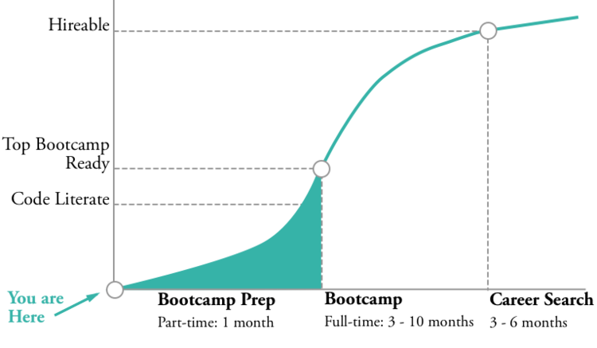

Coding bootcamps have been around since 2012. An estimated 18,300 people will complete bootcamps in 2016, up from 12,100 in 2015.

The prevalence of bootcamps has more recently given rise to a collection of "bootcamp prep" programs. In this article, we'll explore these programs and provide a survey of options currently available.

##WHAT PURPOSE DO BOOTCAMP PREP PROGRAMS SERVE?
####OVERCOME HIGH ADMISSIONS BARS
The most powerful marketing assets bootcamps have at their disposal are successful outcomes. Therefore, bootcamps are motivated to filter for students likely to produce the best outcomes. They look at your work history, your academic track record, your personality, and your technical skills. **Many of the most selective bootcamps actually won’t accept you unless you can prove you’re already capable of a certain level of coding and problem solving skills.**

So how do you improve your coding skills before you’re admitted to the bootcamp? You can do it on your own, or you can join a bootcamp prep program.  There are many excellent free resources online like [Free Code Camp](https://freecodecamp.com) and [CodeCademy](https://codecademy.com), and these are a great places to start. However, it’s important to understand that while learning to code is not rocket science, it does take hours of focus, dedication, and practice – just like mastering a musical instrument. 

You’re not only going to need to decide what to study, but you’re going to need support when you get stuck, and you’re going to need a quiet place where you can stare at your screen as you grit your teeth through the hard problems you’ll grow the most from solving. Be honest with yourself, and consider these questions:

* Have I ever mastered a skill that takes hours of practice on my own?
* Do I have a dedicated place where I can study for at least 12 hours per week as I’m preparing – without a distracting cat / chihuahua / hamster walking across the keyboard?
* Do I have the self-discipline to study this without the structure of an instructor, organized curriculum, and a peer group?

####MAXIMIZE YOUR BOOTCAMP EDUCATION’S VALUE
No matter how good your instructors are, no one can handhold you all the way to mastery. Software engineering is a profession where the learning never ends – you’re never going to be working in a [domain that you fully understand](http://prog21.dadgum.com/154.html), and navigating this uncertainty is part of the game. It’s a skill that a good bootcamp should help you develop, but it’s going to require you to take the initiative to leverage all of your resources to build your solutions.

**Some bootcamps will accept you with very little coding experience, but it’s to your advantage to come in ahead of the curve.** If you’re less prepared than your peers, then you may fall behind in the beginning, and it can be hard to catch up. On the other hand, if you come in at a higher bar then you will be able to explore more advanced topics while you’re still in the nest of your bootcamp. You’ll come out at a higher level with a better portfolio, and you’ll have a much easier time finding your first software engineering job.

####IF CODING ISN'T RIGHT FOR YOU, FIND OUT QUICKLY
Learning to code can most certainly change your life, but it’s also a major investment. Attending a full-time program is typically going to require:   

* Quitting your job.
* $10-25k in tuition.
* 6-10 months of forgone wages. Consider that it takes most people 3-6 months to find a job after finishing a bootcamp.  
**What if you went through all that only to find out you really aren’t so excited about a career in coding?**

"[Fail fast](http://venturebeat.com/2015/03/15/heres-what-fail-fast-really-means/)" is a popular axiom of the startup world that you should consider for your own career path pivot. What you really want is to win, but the worst thing that can happen is to fail slowly. It’s costly in time, money, and lost opportunities. On the other hand, if you fail fast, then you’re able to learn a quick lesson and use it to fuel your next effort.

One advantage of doing a bootcamp prep program is it allows you to really start to understand what this journey is going to look like before you put all your chips on the table. Hopefully you decide you love coding, but it’s not a bad thing to figure out quickly if it’s not for you.

##WHAT FACTORS SHOULD I CONSIDER IN A BOOTCAMP PREP PROGRAM?
####LANGUAGE & TOPICS
The programming language used in your bootcamp prep program should align with the language that bootcamps you are considering use. The majority of programs today are JavaScript focused, but there are some good reasons you might decide you want to start with a different language.

Regardless of the language, a good prep program should truly assume no prior knowledge, and it should absolutely cover at least these introductory topics: boolean logic, arrays, objects/dictionaries, functions/methods, and problem solving techniques. 

####BOOTCAMP CONNECTIONS
Most bootcamp prep programs are connected to immersive coding schools. Others are decoupled but may have partners. If you’re already sure a specific immersive program would be the best for you, then you should sign up for a program attached to the school you want to attend. App Academy has one in SF and NY,  Flatiron has one in NY, and Hack Reactor has an online program.

Now, if you’re still weighing your options and want exploring schools to be part of your prep program, consider a program like First Step Coding that is not attached to larger bootcamp. Programs like FSC will have multiple partner schools that provide you the opportunity to meet face-to-face with instructors and alumni from various schools. They will also likely offer credits to multiple programs. 

####COST AND EDUCATION CREDITS
Cost is a factor to consider, but consider the cost difference relative to the quality of the program and the overall cost of your coding education. Prep programs range from about $800 - $3,000. Online courses are generally less expensive, but they come with some tradeoffs.

Some programs also offer credits for continuing your coding education at an immersive bootcamp afterwards. Hack Reactor, App Academy, and Fullstack will let you credit the cost of their program toward their immersive program. First Step Coding will credit you $500 - $3,000 toward a number of different partner programs. 

####ONLINE VS. IN-PERSON
Bootcamp prep programs come in three flavors:

* **Online – asynchronous.** This is a class that you can participate in at your own pace. You’ll read through content online and then work through problems independently. For some people this flexibility is a huge advantage. For others, it fuels procrastination and makes it harder to stay motivated without the ceremony of a live class to keep you engaged.

* **Online – live.** This is a newer flavor of online education. You can join class from anywhere and you still get the experience of being able to interact with your instructor and classmates in real time. You will need to ensure you have an excellent internet connection and quiet place to join in from regularly. 

* **Classroom – live.** This is the more traditional learning environment. The disadvantages are that you’re limited to attending what is geographically convenient for you, and you may need to commute. On the up side, you’ll likely have an easier time making friends, forming study groups, and feeling comfortable asking questions than you would in an online environment. You’ll also have the helpful ceremony of meeting in a physical space designed for learning and away from any distractions at home.

##WHAT ARE MY OPTIONS?
Below is our filtered list of prep programs. We came across more programs than this, but we have a few qualifiers for what we list here:

* Led by instructors with professional coding experience.
* Clearly active with upcoming classes scheduled.
* Has run for at least 3 cycles.

All of the programs listed happen to feature a JavaScript-based curriculum. Most of the programs also offer "guaranteed admission" to a bootcamp. We did not bother listing this guarantee because in many cases, it's just marketing. If you read the small print, this guarantee normally requires you to apply to specific list of programs, and at least one of the programs in the list will have a low bar for admissions. So it's not a bad guarantee to have, but it also doesn't carry much value.

| Program | Location | Cost | Credits | Format | Perks & Guarantees |
| ------- |:--------:|:----:|:-------:|:------:|:------------------:|
| App Academy Prep - Live | San Francisco, New York City | $2,999 | $2,999 toward App Academy Immersive | 4 weeks M-F 6:30-8:30pm Problem sets between classes | Connection to App Academy |
| App Academy Prep - Online | Online - asynchronous | $1,999 | $1,999 toward App Academy Immersive | Self-paced | Connection to App Academy Flexible work times |
| First Step Coding | Austin, Boston, Chicago, Denver, Irvine, Los Angeles, Miami, New York, Philadelphia, Seattle, San Francisco, Silicon Valley, Washington, D.C. | $1,499 - $2,000 | $1,500 toward Rithm School  $1,500 toward Startup Institute  $1,500 toward Launch Academy  $500 toward Learners Guild  $500 toward App Academy | 4 weeks M, W 6:30-9:30pm Problem sets between classes Slack support 4 hours 1:1 mentoring Q & A sessions with bootcamp alumni | 5:1 student:teacher ratio Pair-programming based curriculum Happiness guaranteed w/ refund option |
| Fullstack Academy | Chicago, New York City | $2,750 | $1,500 toward Fullstack Immersive $1,500 toward Grace Hopper | 4 weeks M-Th 6:40-9:40pm | Connection to Fullstack |
| Hack Reactor Prep | Online - Live | $795 | $795 toward Hack Reactor Immersive | 4 weeks M-Th for 3 hours (morning and evening options available) | Connection to Hack Reactor Study from home convenience w/ the ability to still have the ceremony of a live course |

In summary, bootcamp prep programs are a great way to explore coding and get to know the bootcamp scene before you fully commit. There are a number of good options – it’s just a matter of being honest with yourself and coming to understand what works best for you. 
