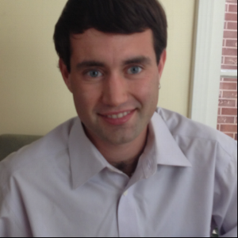

For [First Step Coding](https://firststepcoding.com) alumnus Jake Holtz, his interest in programming began in an unexpected place. Jake developed a love of languages and communication as an undergrad at U.C. Santa Cruz, and he went on to graduate with a B.A in Greek and Latin.

Jake’s first job after college allowed him to dabble with programming, and he realized that software development was the perfect way to combine his interests in language, technology and innovation.

First Step Coding seemed like the perfect starting point for Jake because he could try out programming in a classroom environment, and build the skills necessary to gain acceptance at a top bootcamp.

In an interview with [SwitchUp](http://www.switchup.org/?utm_source=FSC%20GuestPost), Jake talks more about how First Step Coding helped facilitate his career change. Check out the interview below, and read more FSC student stories and reviews on SwitchUp.

**1.)   After earning a B.A. from the University of California Santa Cruz, you made the decision to attend a bootcamp. What made you decide to pursue a career in software development?**

*After college, I worked as a junior analyst for a small retail company. Having a significant amount of autonomy in my position, I began to create spreadsheet “apps” that automated daily tasks that I needed to perform. I’ve always had an innovative mindset, and so this, combined with my work experience led to a natural progression into computer development.*

**2.)   How did you hear about First Step Coding? What made you decide to attend FSC before a bootcamp?** 

*At the beginning of 2016, I began going to meetups at Dev Bootcamp to get an introductory glimpse into computer programming. FSC hosted one of the meetups I attended, and I ultimately chose the program because of its unique approach that no other introductory program offers. FSC integrates traditional teaching with networking and meeting people from all sides of the Bay Area tech community. This is why FSC was so much more than just a “pre-bootcamp program” and why I ended up attended it and enjoying it.*

**3.) What was it like to go from a coding bootcamp prep program to a selective bootcamp like Hack Reactor?**

*I try to be very strategic about decisions I make. I loved FSC, but because of the learning curve, I wasn’t sure I wanted to pursue programming. I spent the next few months continuing to study and finally got to a point of certainty. My friend connected me with a mutual friend who worked at Hack Reactor. I applied, and I was accepted.*

**4.) How did First Step Coding prepare you for life in a bootcamp?**

*FSC’s two-pronged approach [of teaching and networking/pairing with others] was integral to my success at Hack Reactor. FSC introduced me to the collaborative, pair-based learning model used in both bootcamps and in real world software engineering. While I continued to study after FSC, retrospectively, I definitely could not have applied to Hack Reactor without the skills gained from FSC.*

**5.) For you, what were the pros and cons of attending a bootcamp prep program before a bootcamp?**

*PROS: Learning, networking, and a great way to decide if software engineering is right for you,

CONS: Education is expensive!*

**6.) What challenges did you overcome to get to where you are?**

*Developing resilience. One of the reasons Hack Reactor has such an extraordinary reputation is because of the intensity of their program. They overwhelm you with an extravagant amount of information and you basically have to teach yourself (with their help, of course). This process siphons out those unsuitable for the industry and creates a programmer ready to learn large amounts of advanced material in a short amount of time.*

**7.) What are your goals and plans for the next 5 years?**

*Between attending college and working as a Junior Analyst, I lived in northern Israel for a year. I fell in love with life there. My goal in 5 years is to work as a Software Engineer in Tel Aviv. There’s a huge demand for tech workers there– the tech community there is even colloquially known as “Silicon Wadi.” Waze, Viber, Fiverr, and Wix were all founded and are based there, and you have huge R&D centers for Google, Microsoft, Intel, HP, and IBM.*

**8.) What advice do you have for people who are interested in attending a prep program before abootcamp?**

*Great question. Three things:

FIRST: Do as much prep as you can before a bootcamp. There's so much to learn. Also, be smart about what you learn. If you want to be a Web Developer, it would be unwise to learn C or C++ as a first language.

SECOND: Make sure that computer programming is for you. I studied for six months before I was sure I wanted to go to a bootcamp.

THIRD: Be selective about your bootcamp. Bootcamps are like any other business in the sense that there are good ones and bad ones. I personally wouldn’t go to a lower tier college nor would I go to a lower tier bootcamp. It’s an investment.*

Jake Holtz is a San Francisco based full stack software engineer focused on test-driven development and full stack JavaScript technologies. Having attended UC Santa Cruz with a degree in Greek and Latin languages, Jake has a fascination with languages as a medium for communication and functionality.

Linkedin: [linkedin.com/in/jahholtz](https://linkedin.com/in/jahholtz)  
GitHub: [github.com/jakeholtz](https://github.com/jakeholtz)  
AngelList: [https://angel.co/jahholtz](https://github.com/jakeholtz)
